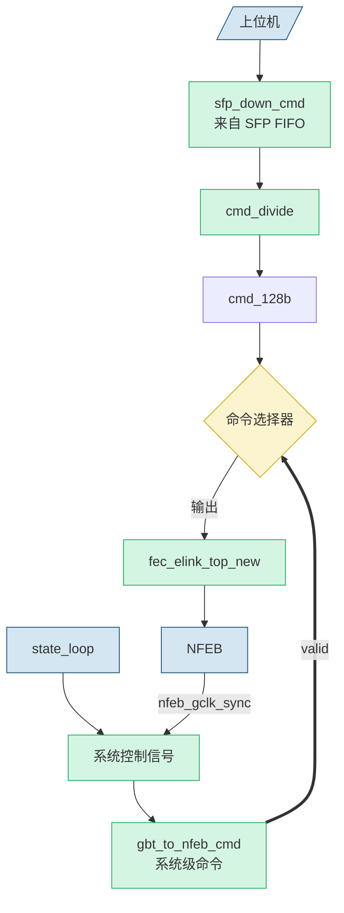

今天主要是想好好读读波形，顺着code

# type-c传输信号（Elink）
## 1 接口
### 1.1 DAQ接口：
#### 1.1.1 对外接口
- elink物理接口
``` verilog
1. 时钟接口:
- ELINK_CLK_Pout[FE_NUM-1:0] // 40MHz时钟输出到NFEB

2. 数据接口:
- ELINK_DATA_Pin[FE_NUM-1:0]  // 160MHz串行数据输入
- ELINK_DATA_Pout[FE_NUM-1:0] // 160MHz串行数据输出

1. 触发/控制接口:
- ELINK_SPARE_Pin[FE_NUM-1:0]  // OR36输入信号,低电平有效,140ns
- ELINK_SPARE_Pout[FE_NUM-1:0] // 同步触发输出到NFEB1. 
 1.命令相关:
- cmd_from_all[16*FE_NUM-1:0]      // 发送到NFEB的命令数据
- cmd_from_all_valid[FE_NUM-1:0]   // 命令有效标志
- pktend[FE_NUM-1:0]               // 命令包结束标志

2. 状态控制:
- ready[FE_NUM-1:0]                // ELINK就绪标志
- idelayReady[FE_NUM-1:0]          // 延时对齐完成标志
- commaFlag[FE_NUM-1:0]            // 逗号字符检测标志
```
- 主要控制信号
``` verilog
1. 命令相关:
- cmd_from_all[16*FE_NUM-1:0]      // 发送到NFEB的命令数据
- cmd_from_all_valid[FE_NUM-1:0]   // 命令有效标志
- pktend[FE_NUM-1:0]               // 命令包结束标志

2. 状态控制:
- ready[FE_NUM-1:0]                // ELINK就绪标志
- idelayReady[FE_NUM-1:0]          // 延时对齐完成标志
- commaFlag[FE_NUM-1:0]            // 逗号字符检测标志
```
- 数据传输流
```verilog
1. 发送流程(cmd):
cmd_from_all -> elink_top模块 -> ELINK_DATA_Pout

2. 接收流程(asic数据):
ELINK_DATA_Pin -> elink_top模块 -> rx_data[16*FE_NUM-1:0]

3. 关键时序:
- 160MHz: 串行数据传输
- 40MHz: 并行数据处理
- 16MHz: 8b/10b编解码
```

单命令触发：cmd_from_all_valid[0]
特定命令触发：pktend[0]（不确定）
#### 1.1.2 fec_elink_top_new 模块
源码
``` verilog
 (*mark_debug = "TRUE"*) wire [FE_NUM-1:0] pktend;

  

  (*mark_debug = "TRUE"*) wire [16*FE_NUM-1:0] rx_data;

  (*mark_debug = "TRUE"*) wire [FE_NUM-1:0] rx_data_valid;

  (*mark_debug = "TRUE"*) wire [FE_NUM-1:0] commaFlag;

  (*mark_debug = "TRUE"*) wire [16*FE_NUM-1:0] cmd_from_all;

  (*mark_debug = "TRUE"*) wire [FE_NUM-1:0] cmd_from_all_valid;

  (*mark_debug = "TRUE"*) wire [FE_NUM-1:0] ready;//high indicates ELINK can transfer command from GBT USB3 to NFEB

  (*mark_debug = "TRUE"*)wire [FE_NUM-1:0] idelayReady;//high indicates data from NFEB is synchronic with GBT clock

  

  (*mark_debug = "TRUE"*) wire elink_rstn;

  

  fec_elink_top_new#(

    .PIN_NUMBER(FE_NUM),

    .LSB_OR_MSB(1'b1),// 0 for LSB first and 1 for MSB first

    .DIF_OR_GBT(1'b0),// 0 for DIF logic and 1 for GBT logic

    .DEBUG_EN(1'b0)//If not use debug core, set to 1'b0

  )fec_elink_top_inst1(

    .clk_16m(clk16M),               // Clk for 10b encoded data and 8b decoded data

    .clk_40m(clk40M),               // Clk for de-serial 4bit data and user data

    .clk_160m(clk160M),              // Clk for serial data

    .clk_200m(clk200M),// Reference clock for IDELAYCTRL. Has to come from BUFG.

    .reset_n(RESET_N&&power_on_resetn),               // Async reset

    .elink_rstn(elink_rstn),

    .elink_dataout_reset_n(fifoRstn),// Async reset the data output sync module

  

    .elink_clk_out_to_pins_o(ELINK_CLK_Pout[FE_NUM-1:0]),

    // Data in

    .data_in_from_pin_i(ELINK_DATA_Pin[FE_NUM-1:0]),   // Serial data in from IDELAY2

    .rx_data_16b_o(rx_data[16*FE_NUM-1:0]),         // Deceoded data synchronised to the clk_40m

    .rx_data_16b_en_o(rx_data_valid[FE_NUM-1:0]),      // High level indicate that data is valid

    .comma_detected_o(commaFlag[FE_NUM-1:0]),      // High indicates a comma word is detected

    // Data out

    // Data in interface: external logic --> gearbox

    .s_axis_tdata_i(cmd_from_all[16*FE_NUM-1:0]),// TX data 16b from master

    .s_axis_tvalid_i(cmd_from_all_valid[FE_NUM-1:0]),

    .s_axis_tlast_i(pktend[FE_NUM-1:0]),// If multiple tlast is sent during the transmit, only the last tlast is valid

    .s_axis_tready_o(ready[FE_NUM-1:0]),// Only tready is valid the data will be send successfully

    // Delay and bit control

    .delay_alignment_en_i(8'hFF),  // If not used, leave it high. Enable idelayctrl, if 0, the dly_align_ctrl moudule will never start

    .usr_dly_initial_en_i(8'b0),  // If not used leave it low. Initial the delay calculate process with user command

    .usr_dly_load_i(8'b0),        // If not used, leave it low. Load the delay tap with the user set

    .usr_dly_tap_i(40'b0),         // If not used, set to 5'b0

    .dly_tap_from_io_o(),// Current delay_tap value

    .delay_stable_o(idelayReady[FE_NUM-1:0]),        // If not used, leave it float. Idelay initial done

  

    .idle_symbol_i(8'hBC),         // Control symbol is defined in FELIX, must be comma

    .start_symbol_i(8'h3C),

    .end_symbol_i(8'hDC),

    // Data to LVCMOS33 pin, if other standard used, modify the

    // oserdes_4in1out module

    .data_out_to_pin_o(ELINK_DATA_Pout[FE_NUM-1:0])

    );
```

- 参数配置
``` verilog
fec_elink_top_new#(
    .PIN_NUMBER(FE_NUM),      // 前端板数量,这里是8
    .LSB_OR_MSB(1'b1),        // 1:MSB优先, 0:LSB优先 
    .DIF_OR_GBT(1'b0),        // 0:DIF逻辑, 1:GBT逻辑
    .DEBUG_EN(1'b0)           // 调试使能
)
```
- 时钟接口
``` verilog
 多时钟域:
- clk_16m: 用于10b/8b编解码数据
- clk_40m: 用于4bit并行数据和用户数据
- clk_160m: 用于串行数据传输
- clk_200m: IDELAYCTRL参考时钟
```
- 复位和控制信号
``` verilog
1. 复位信号:
- reset_n: 异步复位
- elink_rstn: elink复位
- elink_dataout_reset_n: 数据输出同步模块复位

2. 延时控制:
- delay_alignment_en_i: IDELAYCTRL使能
- delay_stable_o: 延时初始化完成标志
```
- 数据传输接口
``` verilog
1. 接收数据:
- data_in_from_pin_i: 来自IDELAY2的串行输入
- rx_data_16b_o: 解码后的16位并行数据
- rx_data_16b_en_o: 数据有效标志
- comma_detected_o: 逗号字符检测标志
1. 发送数据:
- s_axis_tdata_i: 16位发送数据
- s_axis_tvalid_i: 发送数据有效
- s_axis_tlast_i: 包结束标志
- s_axis_tready_o: 发送就绪标志
```
- 特殊控制字符
``` verilog
// 控制字符定义
.idle_symbol_i(8'hBC),    // 空闲字符(comma)
.start_symbol_i(8'h3C),   // 开始字符
.end_symbol_i(8'hDC),     // 结束字符
```
- 物理接口
``` verilog
1. 时钟输出:
- elink_clk_out_to_pins_o: 40MHz时钟输出到NFEB

2. 数据输出:
- data_out_to_pin_o: LVCMOS33标准串行数据输出
```

命令下发
``` verilog
assign cmd_from_all = gbt_to_nfeb_cmd_valid ?
                       {gbt_to_nfeb_cmd, gbt_to_nfeb_cmd, ...} :
                       cmd_128b;
assign gbt_to_nfeb_cmd_valid = (
gbt_to_nfeb_cmd_valid||
send_stopnfeb_pulse||
send_slow_clock_sync_pulse||
all_clear_1cycle||
nfeb_gclk_sync||
(nfeb_spiroc_rst[39]))
? 1'b1 : 1'b0;                       
```
1. 常规命令下发（cmd_128b）
```
1. 数据流:
上位机 -> SFP -> sfp_down_cmd -> cmd_divide模块 -> cmd_128b -> cmd_from_all

2. 使用场景(看cmd_divide):
- 配置命令(如阈值设置、DAC配置等)
- 单板控制命令
- 其他常规操作命令
```
cmd_divide(看到这个地方，插入链接)
1. 系统控制命令(gbt_to_nfeb_cmd)


```
1. 数据流:
内部状态机触发 -> gbt_to_nfeb_cmd -> cmd_from_all

2. 使用场景:
- SPIROC复位(0x0400)
- elink复位(0x1f00)
- 时钟同步(0x1e00)
- 全局清除(0x1c00)
- 开始/停止采集(0x0100/0x0200)
```


系统控制信号：





### 1.2 再来简单解释一下 elink的发送逻辑（接收的逻辑应该就是反的）

``` plaintxt
1.数据流向
16bit命令数据 -> 8bit数据 -> 10bit编码 -> 4bit串行输出

2.具体流程：
1. s_axis_tdata_i[15:0] (16位输入数据)
   ↓ (elink_dataout_gearbox_axi)
2. tx_data_8b_w[7:0] (8位数据)
   ↓ (ENC8B10B编码器)
3. tx_data_10b_encoded_w[9:0] (10位编码数据)
   ↓ (elink_gearbox_10b_4b)
4. tx_data4b_to_oserdes_w[3:0] (4位并行数据)
   ↓ (oserdes_4in1out)
5. data_out_to_pin_o (1位串行输出)
```


``` plaintxt
3.重要模块
1. elink_dataout_gearbox_axi:
   - 输入: 16位数据
   - 输出: 8位数据
   - 功能: 数据分包、帧头尾添加

2. ENC8B10B:
   - 输入: 8位数据
   - 输出: 10位编码数据
   - 功能: 8b/10b编码

3. elink_gearbox_10b_4b:
   - 输入: 10位编码数据
   - 输出: 4位并行数据
   - 功能: 位宽转换

4. oserdes_4in1out:
   - 输入: 4位并行数据
   - 输出: 1位串行数据
   - 功能: 并串转换
```


## 2 发送命令
 1.  先发送FEB_CLK_RST 0X03
	 daq
![[Pasted image 20250721094535.png]]
	FEE
这是一帧数据
![[Pasted image 20250721094729.png]]
现在收到的又是这样了
![[Pasted image 20250721153119.png]]
发别的命令，fee没有响应，这很奇怪

疑似确定了一件事，这个频率是上限![[Pasted image 20250721155814.png]]


DAQ的elink调试信号（太难找了）
![[Pasted image 20250722093530.png]]


# 20250722 用参考DAQV2 发送波形 FEE V2接受波形
## 1 发生ff03 （fee_clk_rst）
DAQ V2
![[Pasted image 20250722200349.png]]
FEE V2
rx_cmd 初始是5aff，接收到指令后包头是 ffa5 
![[Pasted image 20250722200512.png]]


这个问题啥情况啊？![[fee触发出问题.gif]]

# 20250723 依然是调试DAQ
![[Pasted image 20250723092443.png]]
发送b0_ext_1bv_trig450_delay200_hg45_v2.dat 文件


## 1 再来看Elink的debug
最前面的似乎是包头？先不管，去查源码![[Pasted image 20250723094332.png]]
这之后就是正常的数据了？![[Pasted image 20250723094441.png]]
ff 00 5a ba 5a ff dc？似乎是后缀
![[Pasted image 20250723095848.png]]

## 2 再回到DAQ V4
似乎只有fee_clk_rst能被elink正确传输，配置命令就不行了
1. 发送fee_clk_rst elink
![[Pasted image 20250723101630.png]]
2. 发送config命令 sfp正确，但是elink不对
![[Pasted image 20250723101802.png]]
~~疑似约束不对！~~
信号频率上去了就能采到数了
