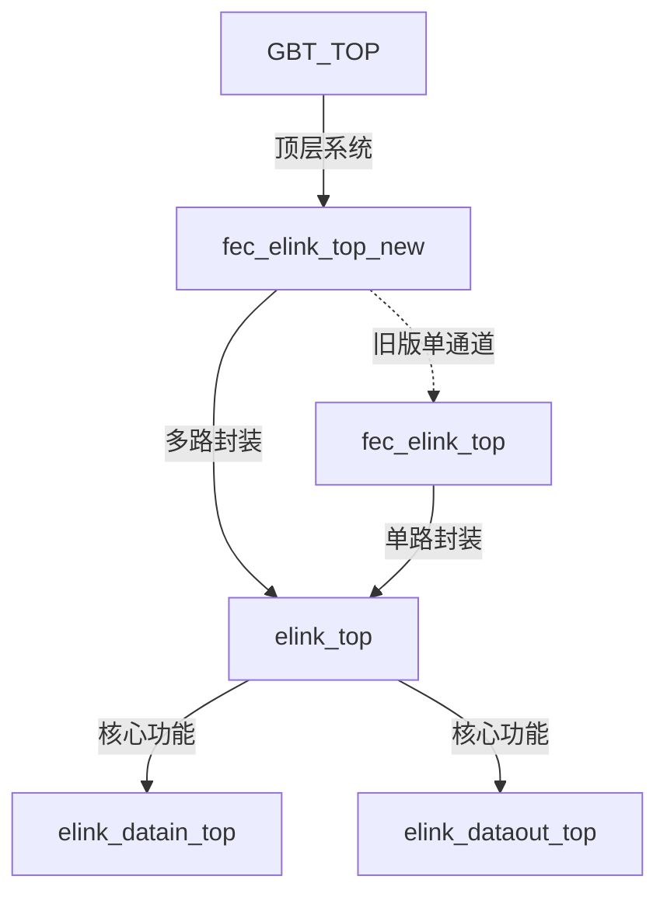
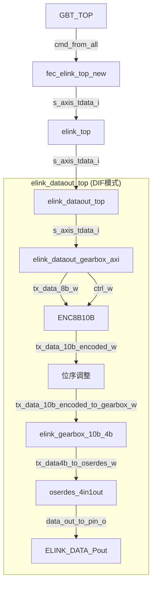

相关的文件有很多，参考
F:\01_USTC_git\01_LOGIC\muon_spiroc_logic\02_MISDAQ_V3\MISDAQ_LOGIC_GRO_SEEKER.srcs\sources_1\imports\elink

先来说下GBT_TOP里的模块使用


这个elink模块经过了多层封装，比如fec_elink_top_new这一个模块的功能：
1. 对多路io进行延时同步
2. 封装FEE_NUM 个elink接口
然后核心的模块就是elink_top了，它包含收 发 两个功能大模块

下面继续看in out子module
DIF 模式下，命令下发数据流大概是这样
``` plaintxt
16bit数据@40MHz → 8bit数据@16MHz → 8b10b编码 → 10bit编码数据@16MHz → 4bit分段@40MHz → 1bit串行@160MHz   

(传输到elink_dataout_top的数据长度是16bit，随后才做了8bit 10bit 4bit 1bit操作)

GBT_TOP → fec_elink_top_new → elink_top → elink_dataout_top → [各子模块]
```


## 1 Elink标准数据帧格式


``` verilog
    .idle_symbol_i(8'hBC),         // Control symbol is defined in FELIX, must be comma

    .start_symbol_i(8'h3C),

    .end_symbol_i(8'hDC),
```


elink数据格式如下：
```
<K28.5>...<K28.5><K28.1><数据...><K29.7><K28.5>...
   空闲      │     起始     │      结束    │  空闲
            └─────────────┴──────────────┘
                        完整数据帧
```


 


## 2 喜报
![[Pasted image 20250724214341.png]]
过阈之后能正常收数了
![[Pasted image 20250724214641.png]]
但是命令长度还是不对？这是为什么？