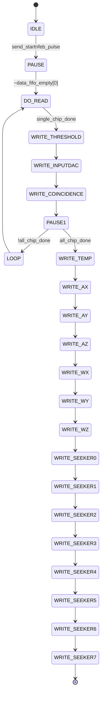

参考文章：https://www.yuque.com/zhuangh/hlh2wb/gm9r85ogxgi380du
1mDAQ 使用
参考代码笔记 NFEB8_data_socket, GBT_TOP
# 关于数据上传

## 上传路径


```  plaintex
NFEB[0-4] → ELINK接口 → fec_elink_top → NFEB_data_fifo[0-4] → 
NFEB8_data_socket → all_NFEB_data_fifo → sfp_up_fifo → 
SiTCP → SFP光纤 → DAQ计算机
```

# 重启测试
配置信息 normal_dac280.dat
目前看采数是正常的，现在需要解析包长为什么是这样的
![[Pasted image 20250807164026.png]]
现在仔细研究这个包的结构

中间72通道数据包，为啥最后一位是3494？
![[Pasted image 20250807165553.png]]

FEEE FEEE 似乎是包尾 FF01是板号 34xx是ch36的返回数据？（不太清楚为什么是这个）
需要返回看下逻辑
![[Pasted image 20250807171357.png]]
修改了逻辑，似乎正常了？对比前一个数据集，需要对比test06.dat和test05.dat
![[Pasted image 20250807174632.png]]
下面这帧数据：
```
FEEE FEEE 
0118 008D 0001 FF01 FD30 0050 0054 3EA0 FE1E 009A FF7F 0000 0000 0000 0000 0000 FFFF 0000 5ABA 5AFF FFA5 ABA5 0000 
FFFF
```
两个 FEEE 之后的数据就是阈值配置&seeker&陀螺仪的数据了，两个FEEE 前 72 个 2 字节数据就是 72 ch 的数据
![[Pasted image 20250807222120.png]]

## 具体数据解释

#### 1. 探测器数据部分
21 xx  X 72 不过最后一个通道的数据疑似有问题
- **FEEE FEEE**: 这是探测器数据的结束标识
    - 第一个 `FEEE` 被计数器检测
    - 第二个 `FEEE` 触发 `single_chip_done` 信号，标志单芯片数据读取完成
#### 2. 配置参数回读部分（紧跟在 FEEE FEEE 之后）
根据状态机转换：
`DO_READ` → `WRITE_THRESHOLD` → `WRITE_INPUTDAC` → `WRITE_COINCIDENCE`
**两个 FEEE 后的数据含义：**
1. **0118** - WRITE_THRESHOLD 状态输出
    - 这是当前 `fifo_token` 对应NFEB的阈值配置
    - 值 `0x0118` = 280 (十进制)
2. **008D** - WRITE_INPUTDAC 状态输出
    - 这是当前 `fifo_token` 对应NFEB的输入DAC配置
    - 值 `0x008D` = 141 (十进制)
3. **0001** - WRITE_COINCIDENCE 状态输出
    - 符合模式配置，格式：`{8'h0, coincidence_mode}`
    - 值 `0x0001` 表示符合模式为 1
4. **FF01** - PAUSE1 状态输出（芯片ID标识）
    - 格式：`{8'hff, fifo_token}`
    - `FF01` 表示：高8位 = 0xFF（固定标识），低8位 = 0x01（表示这是NFEB1的数据）
#### 3. 传感器数据部分
```
WRITE_TEMP → WRITE_AX → WRITE_AY → WRITE_AZ → WRITE_WX → WRITE_WY → WRITE_WZ → WRITE_SEEKER0 → ... → WRITE_SEEKER7
```
1. **FD30** - WRITE_TEMP (温度数据)
2. **0050** - WRITE_AX (加速度计X轴)
3. **0054** - WRITE_AY (加速度计Y轴)
4. **3EA0** - WRITE_AZ (加速度计Z轴)
5. **FE1E** - WRITE_WX (陀螺仪X轴)
6. **009A** - WRITE_WY (陀螺仪Y轴)
7. **FF7F** - WRITE_WZ (陀螺仪Z轴)
8. **0000** - WRITE_SEEKER0 (Seeker数据0)
9. **0000** - WRITE_SEEKER1 (Seeker数据1)
10. **0000** - WRITE_SEEKER2 (Seeker数据2)
11. **0000** - WRITE_SEEKER3 (Seeker数据3)
12. **0000** - WRITE_SEEKER4 (Seeker数据4)
13. **FFFF** - WRITE_SEEKER5 (Seeker数据5)
14. **0000** - WRITE_SEEKER6 (Seeker数据6)
15. **5ABA** - WRITE_SEEKER7 (Seeker数据7)

修改了 Seeker 传出的数据确实有变化

![[Pasted image 20250808113821.png]]


把陀螺仪的数据也堵塞了，修改为 AABB，现在一帧数据的结构就比较清晰了
![[Pasted image 20250808184155.png]]


## 现在来总结数据帧的结构

| 数据类型         | 测试模式值      | 正常模式来源      | 控制信号               |
| ------------ | ---------- | ----------- | ------------------ |
| **陀螺仪数据**    | `16'hAABB` | MPU6050实时数据 | `gyro_test_mode`   |
| **seeker数据** | `16'hEEEE` | UART接收数据    | `seeker_test_mode` |
| **NFEB数据**   | 实际采集       | ELINK接口数据   | N/A                |


以其中一帧数据为例，陀螺仪&seeker 数据选取的是测试数据，NFEB 是实际采集到的正弦波数据
``` dat
FA5A  -包头
21A7 21AC 21BB 21AD 21B7 21A9 21A7 21A6 21B0 21AC 21A7 21AA 21B7 21A8 21AC 21B0 21AA 21B1 21B4 21A7 21B5 21B0 21AC 21B5 21AA 21B2 21B5 21AA 21AC 21B0 21AC 21AE 21B2 21AF 2196 3187 21A1 21B5 21B5 219E 21AB 21AB 21A8 21AA 21B1 21AC 21B8 21AD 21B0 21B4 21A6 21B0 21B0 21AC 21B6 21B8 21AE 21B0 21A9 21B5 21AE 21A8 21AC 21AC 21B6 21B9 21A9 21A8 21AC 21B9 219E 31A2 57EC 0001 F000 0002 -FEE数据
FEEE FEEE --FEE数据结束标志
0118 008D 0001  
FF01 -板号 表示第一个板卡
AABB AABB AABB AABB AABB AABB AABB     -陀螺仪数据
EEEE EEEE EEEE EEEE EEEE EEEE EEEE EEEE  -寻北仪数据
FFFF 0000 5ABA 5AFF FFA5 ABA5 0000 FFFF        -包尾
```

结构图如下
┌─────────────────────────────────────────────────────────────────┐
│                    MISDAQ_V 4 数据帧格式                                                           │
├─────────────────────────────────────────────────────────────────┤
│ 帧头 │ NFEB 数据段 │ 系统参数段 │ 陀螺仪数据段 │ 寻北仪数据段 │ 帧尾 │
└─────────────────────────────────────────────────────────────────┘
详细字段表

| 字段类别        | 字段名称          | 数据值                       | 长度    | 描述                    |
| ----------- | ------------- | ------------------------- | ----- | --------------------- |
| **帧头标识**    | Frame Header  | `FA5A`                    | 16bit | 数据帧起始标识               |
| **NFEB数据段** | ADC Data      | `21A7 21AC ... 2196 3187` | 变长    | NFEB芯片采集的ADC数据        |
|             | Data End Mark | `FEEE FEEE`               | 32bit | NFEB数据结束标识            |
| **芯片标识段**   | Chip ID       | `0118`                    | 16bit | 芯片编号(格式: FF0x, x=芯片号) |
| **配置参数段**   | Threshold     | `008D`                    | 16bit | 阈值参数                  |
|             | Input DAC     | `0001`                    | 16bit | 输入DAC参数               |
|             | Coincidence   | `FF01`                    | 16bit | 符合模式配置                |
| **陀螺仪数据段**  | Temperature   | `AABB`                    | 16bit | 温度数据(测试模式)            |
| 7 byte      | Accel X       | `AABB`                    | 16bit | X轴加速度(测试模式)           |
|             | Accel Y       | `AABB`                    | 16bit | Y轴加速度(测试模式)           |
|             | Accel Z       | `AABB`                    | 16bit | Z轴加速度(测试模式)           |
|             | Gyro X        | `AABB`                    | 16bit | X轴角速度(测试模式)           |
|             | Gyro Y        | `AABB`                    | 16bit | Y轴角速度(测试模式)           |
|             | Gyro Z        | `AABB`                    | 16bit | Z轴角速度(测试模式)           |
| **导引头数据段**  | Seeker Data 0 | `EEEE`                    | 16bit | 导引头数据0(测试模式)          |
| 8 byte      | Seeker Data 1 | `EEEE`                    | 16bit | 导引头数据1(测试模式)          |
|             | Seeker Data 2 | `EEEE`                    | 16bit | 导引头数据2(测试模式)          |
|             | Seeker Data 3 | `EEEE`                    | 16bit | 导引头数据3(测试模式)          |
|             | Seeker Data 4 | `EEEE`                    | 16bit | 导引头数据4(测试模式)          |
|             | Seeker Data 5 | `EEEE`                    | 16bit | 导引头数据5(测试模式)          |
|             | Seeker Data 6 | `EEEE`                    | 16bit | 导引头数据6(测试模式)          |
|             | Seeker Data 7 | `EEEE`                    | 16bit | 导引头数据7(测试模式)          |
| **其他数据段**   | Reserved      | `FFFF 0000 5ABA...FFFF`   | 64bit | 似乎是包尾                 |
"FFFF 0000 5ABA 5AFF FFA5 ABA5 0000 FFFF        -包尾" 这部分不清楚是怎么回事，疑似是 sitcp 固定包尾?? 

NFEB_data_socket. V 打包数据的状态机如下

